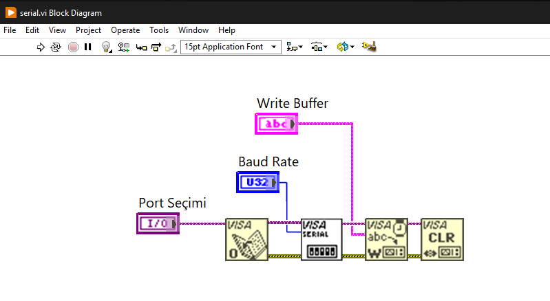
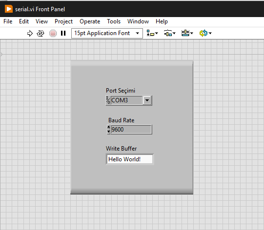

# NI LabVIEW 2024 Serial Port Hello World Example

- This is a basic serial communication example between two virtual serial ports **(from COM3 to COM2)**. It can also be used for non-virtual ports.
- VSPE, developed by [Eterlogic](https://eterlogic.com/products.vspe.html), is used to create virtual serial ports.

## NI LabVIEW Block Diagram Design

## NI LabVIEW Front Side

## Output on COM2

