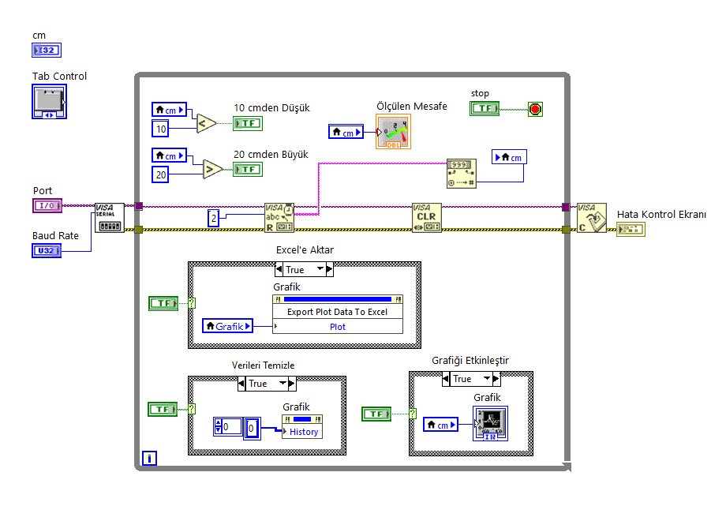
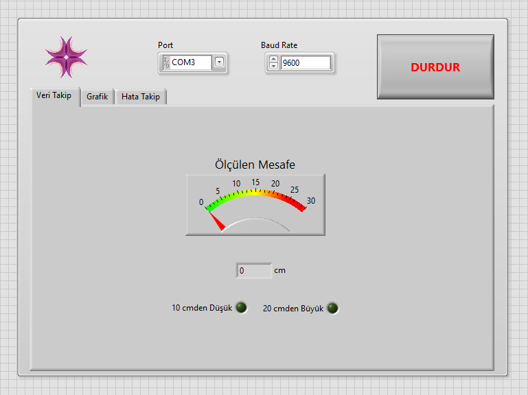
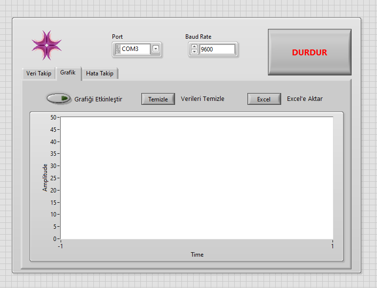
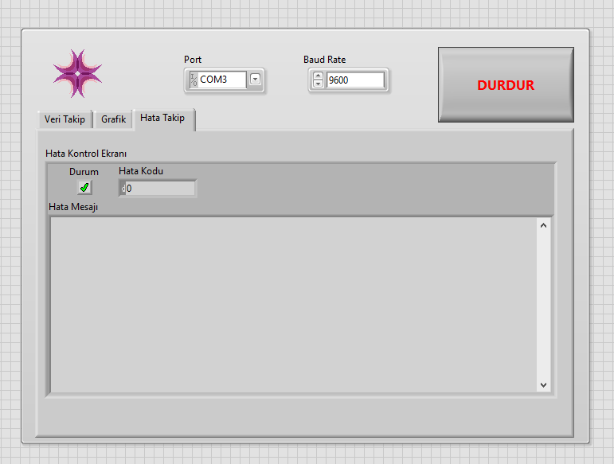

## Video

https://github.com/user-attachments/assets/8a5363be-6210-4b5f-99e2-706c26db3156

# Read the HC-SR04 Data with LabVIEW

- In this project, distance data is read from the HC-SR04 sensor in real time. An Arduino is used to create a circuit that reads data from the HC-SR04.

## Arduino Circuit

## NI LabVIEW Block Diagram Design

## NI LabVIEW Front Side

